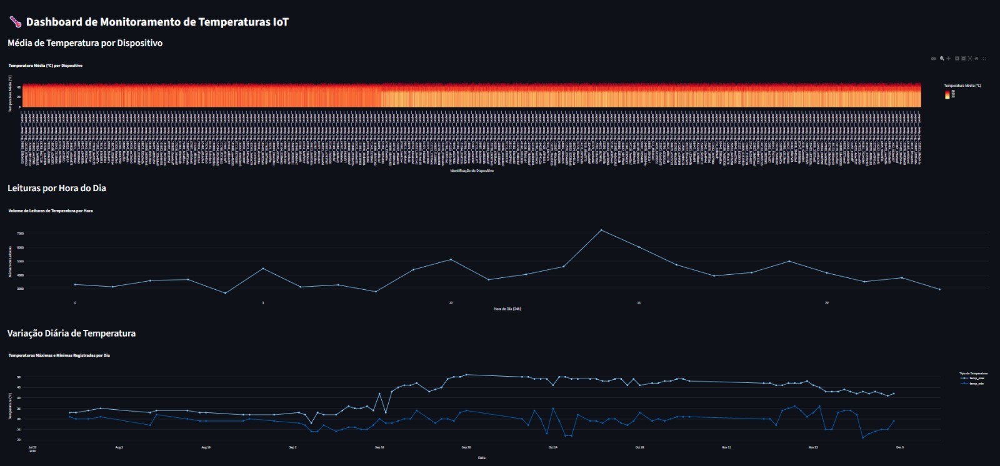

# Pipeline de Dados com IoT, Docker e Streamlit

## Sobre o Projeto

Este projeto, desenvolvido para a disciplina de "Disruptive Architectures: IoT, Big Data e IA", consiste na construção de um pipeline de dados completo. O objetivo é processar, armazenar e visualizar leituras de temperatura de dispositivos IoT, utilizando tecnologias modernas de engenharia de dados.

O pipeline realiza as seguintes etapas:
1.  **Ingestão:** Lê dados de um arquivo CSV.
2.  **Armazenamento:** Insere e armazena os dados em um banco de dados PostgreSQL, executado de forma isolada em um contêiner Docker.
3.  **Transformação:** Utiliza Views SQL para pré-processar e agregar os dados, preparando-os para análise.
4.  **Visualização:** Apresenta os dados de forma interativa em um dashboard web criado com Streamlit.

---

## Tecnologias Utilizadas

* **Linguagem:** Python 3
* **Banco de Dados:** PostgreSQL
* **Contêineres:** Docker
* **Bibliotecas Python:**
    * `pandas` para manipulação de dados.
    * `sqlalchemy` e `psycopg2-binary` para conexão com o PostgreSQL.
    * `streamlit` para a criação do dashboard interativo.
    * `plotly` para a geração dos gráficos.
* **Controle de Versão:** Git & GitHub

---

## Estrutura do Projeto

- **/data**: Contém o dataset original (`IOT-temp.csv`).
- **/src**: Contém os scripts Python.
  - `data_processor.py`: Script para ingestão e processamento dos dados.
  - `dashboard.py`: Script do dashboard interativo com Streamlit.
- `views.sql`: Arquivo com os comandos para a criação das Views SQL.
- `dashboard-screenshot.jpeg`: Imagem de exemplo do dashboard.
- `README.md`: Esta documentação.

## 🚀 Como Executar o Projeto

Siga os passos abaixo para executar o projeto em seu ambiente local.

### Pré-requisitos

* [Python 3.8+](https://www.python.org/downloads/)
* [Docker Desktop](https://www.docker.com/products/docker-desktop/)
* [Git](https://git-scm.com/downloads/)

### Passos de Instalação e Execução

1.  **Clone o repositório:**
    ```bash
    git clone [https://github.com/JohnatanChavess/projeto-iot-pipeline.git](https://github.com/JohnatanChavess/projeto-iot-pipeline.git)
    cd projeto-iot-pipeline
    ```

2.  **Crie e ative um ambiente virtual:**
    ```bash
    python -m venv venv
    # No Windows (Git Bash)
    source venv/Scripts/activate
    ```

3.  **Instale as dependências:**
    ```bash
    pip install pandas psycopg2-binary sqlalchemy streamlit plotly
    ```

4.  **Inicie o contêiner do PostgreSQL com Docker:**
    *(Certifique-se de que o Docker Desktop está em execução)*
    ```bash
    docker run --name postgres-iot -e POSTGRES_PASSWORD=sua_senha -p 5432:5432 -d postgres
    ```
    **Importante:** Lembre-se de substituir `sua_senha` pela senha que você usará e de atualizar a mesma senha nos arquivos `.py`.

5.  **Execute o script de ingestão de dados:**
    ```bash
    python src/data_processor.py
    ```

6.  **Crie as Views no Banco de Dados:**
    Conecte-se ao banco de dados (usando DBeaver ou outra ferramenta) e execute os comandos SQL presentes no arquivo `views.sql` (nós ainda vamos criar este arquivo).

7.  **Execute o dashboard:**
    ```bash
    streamlit run src/dashboard.py
    ```
    O dashboard abrirá automaticamente em seu navegador.

---

## 📊 Dashboard


